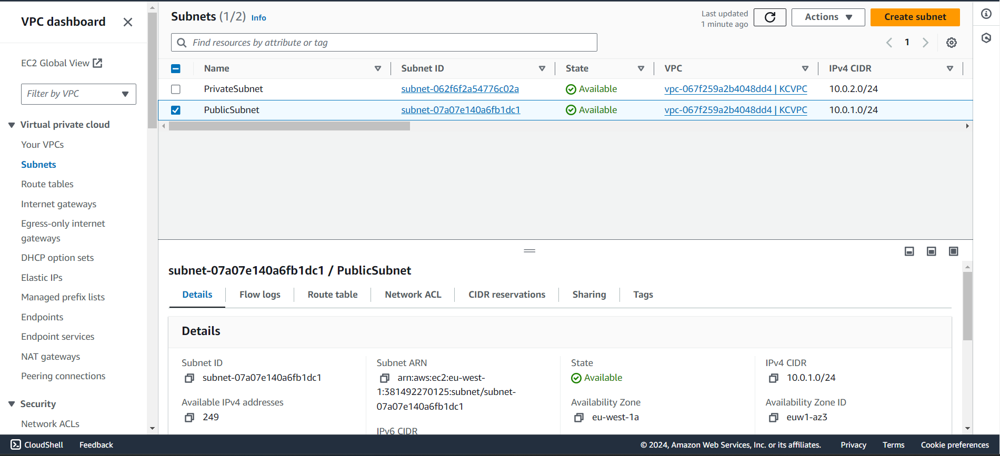
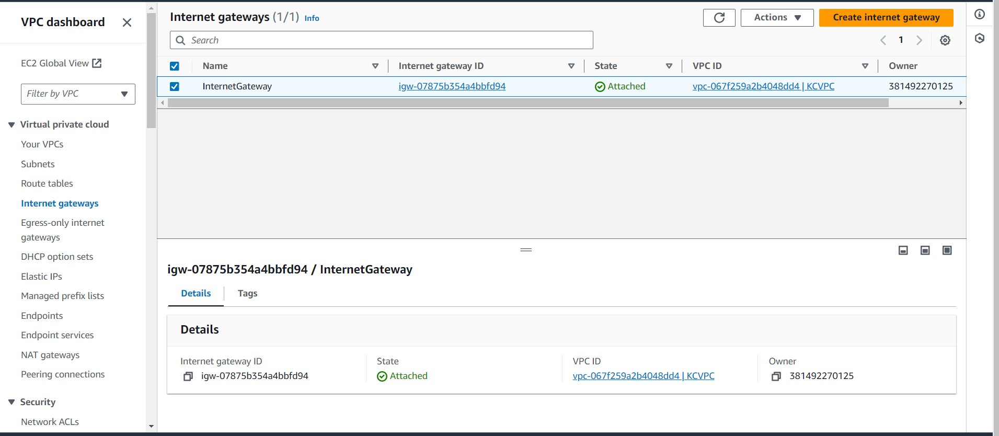
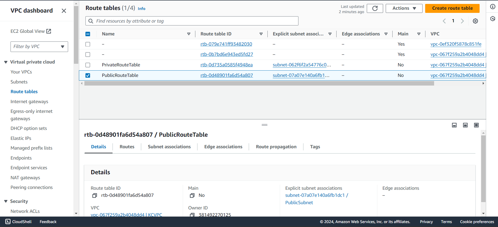
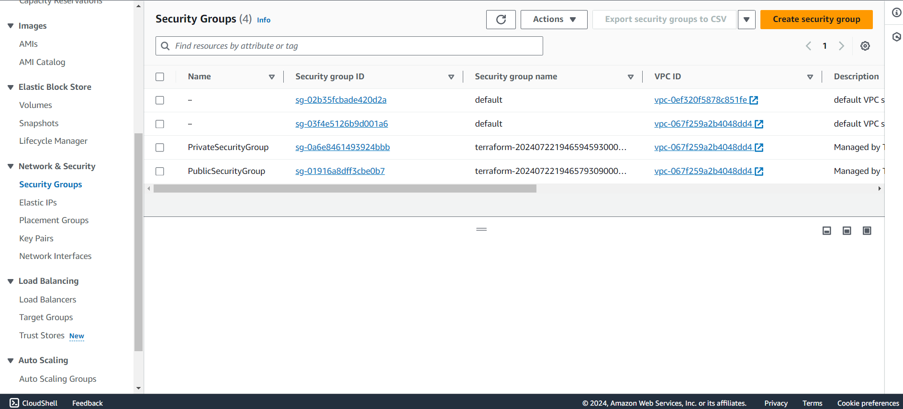
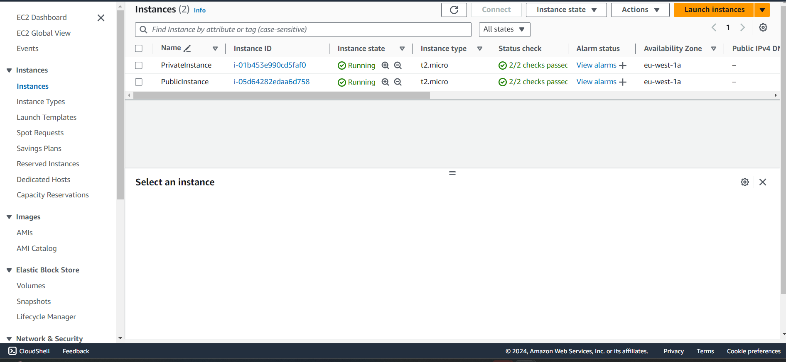

# Objective

Design and set up a Virtual Private Cloud (VPC) with both public and private subnets using Terraform. 
Implement routing, security groups, and network access control lists (NACLs) to ensure proper communication and security within the VPC. Deploy an Ubuntu EC2 instance in each subnet in the AWS EU-West-1 (Ireland) region. 
Create separate child modules for resources and reference them in the root module for readability and re-usability of the code. 
Write a script to install Nginx on the EC2 instance in the public subnet upon deployment. 
Write a script to install PostgreSQL on the EC2 instance in the public subnet upon deployment. 
Clean up resources on completion using `terraform destroy`.

# Prerequisites

- Download and install Terraform.
- Download and install the AWS CLI.
- Create an IAM user and generate access keys for that IAM user.

## STEP 1: Set Up The Environment

- Ensure Terraform and AWS CLI are installed.
- Configure AWS CLI with IAM user credentials:
  ```sh
  aws configure


## STEP 2: Create the Project Directory
Create a directory for your Terraform project and navigate into it (kcamptask6):
```sh
mkdir kcamptask6
cd kcamptask6

## STEP 3: Create a VPC
- **Name:** KCVPC
- **IPv4 CIDR block:** 10.0.0.0/16
- **Script:** `kcvpc.tf`
- **Image:**
  

## STEP 4: Subnets
- **Script:** `kcvpc.tf`
- **Image:**
  

```hcl
resource "aws_subnet" "PublicSubnet" {
  vpc_id            = aws_vpc.KCVPC.id
  cidr_block        = var.public_subnet_cidr
  availability_zone = var.availability_zone
  tags = {
    Name = "PublicSubnet"
  }
}

resource "aws_subnet" "PrivateSubnet" {
  vpc_id            = aws_vpc.KCVPC.id
  cidr_block        = var.private_subnet_cidr
  availability_zone = var.availability_zone
  tags = {
    Name = "PrivateSubnet"
  }
}


## STEP 5: Internet Gateway (IGW)
- **Script:** `kcvpc.tf`
- **Image:**
  


## STEP 6: Route Tables
- **Script:** `kcvpc.tf`
- **Image:**
  


## STEP 7: NAT Gateway
- **Script:** `kcvpc.tf`
- **Image:**
  


## STEP 8: Security Groups
- **Script:** `kcvpc.tf`
- **Image:**
  


## STEP 9: Network ACLs
- **Script:** `kcvpc.tf`
- **Image:**
  


## STEP 10: Deploy 2 EC2 Instances on Each Subnet
- **Script:** `kcec2.tf`
- **Image:**
  


## STEP 11: Script to Install Nginx on EC2 Instance in the Public Subnet on Deployment
- **Script:** [kcec2.tf](kcec2.tf)

## STEP 12: Script to Install PostgreSQL on EC2 Instance in the Public Subnet on Deployment
- **Script:** [kcec2.tf](kcec2.tf)

## Cleanup
Use `terraform destroy` to clean up resources after completing the deployment:
```sh
terraform destroy
